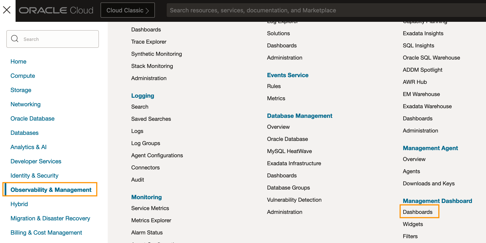
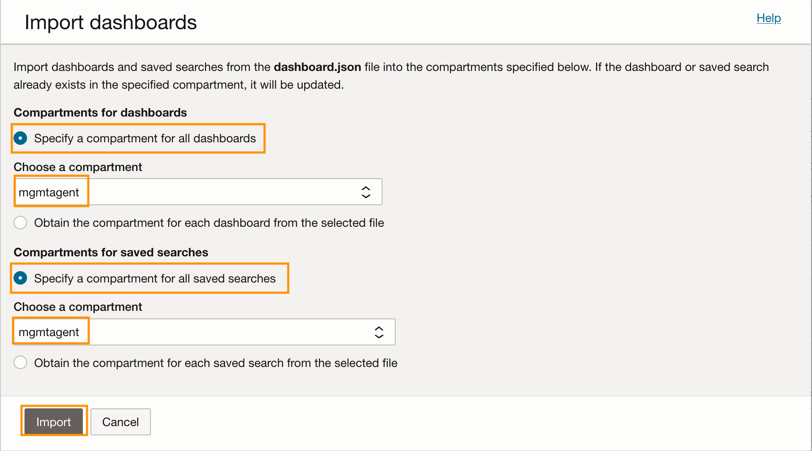
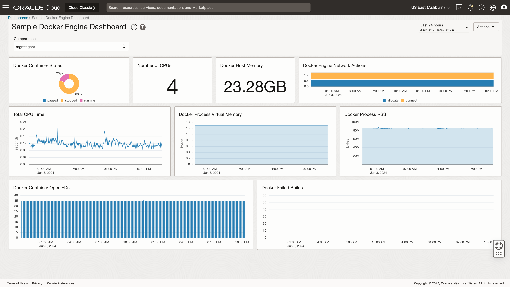

# **OCI Management Agent - Sample Dashboards**

## About
The dashbaords provided here can be imported into the Management Dashbaord under Observability & Management.  These dashboards contain sample MQL based widgets that are provided as an example on how to create and visualize metrics collected by Management Agent.

## Importing Dashboards

Navigate to the Management Dashboard menu.  The Management Dashboards available in the samples can be imported into the Management Dashboard.
### Management Dashboard

### Importing the dashboard
Import the Dashboard by clicking on the Import dashboards button and selecting the json file listed in the sample. Ensure that you import the dashboard and the saved searches in the right compartment.  See highlighted text here:

## Samples
Each of the sample dashboard provided here depends on the metrics emitted to a particular OCI Monitoring namespace. 

### Docker Engine Dashbaord

OCI Monitoring Namespace : demo_prometheus

## Copyright
Copyright (c) 2024 Oracle and/or its affiliates.
